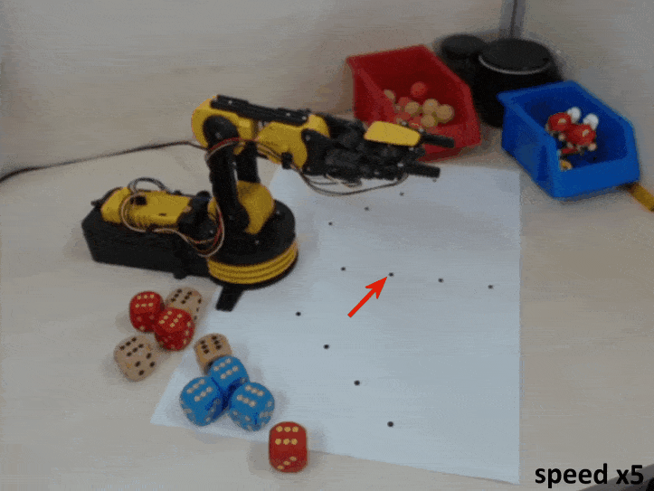

## CRAVES: Controlling Robotic Arm with a Vision-based, Economic System

The craves.ai project controls a toy robotic arm (OWI-535) with a single RGB camera. Please see the system pipeline and how it works in [docs/README.md](docs/README.md) first before trying the code. The following animation shows the arm controlling by a mounted camera to reach a goal without relying on any other sensors.



## Dataset Download

Download the datasets from [here](http://www.cs.jhu.edu/~qiuwch/craves/dataset/).

Put the zipped file into folder ./data and unzip it. For example, you can put the test dataset into folder `./data/test_20181024.zip` and unzip it.

- 20181107.zip, synthetic training images and ground truth
- ft_20181105.zip, real lab images for fine-tuning with semi-supervised fake labels
- test_20181024.zip, lab test images with 3D ground truth 
- youtube_20181105.zip, youtube test images with 2D ground truth

for instance, the synthetic images folder should look like this:

```
./data/20181107
│   readme.txt 
│
└───angles                  //ground-truth motor angles   
│   
└───FusionCameraActor3_2
│   └───caminfo             // ground-truth camera parameters 
│   └───lit                 // RGB images
│   └───seg                 // parsing 
│
└───joint                   // joint position in 3D space   
│
└───puppeteer               
│
└───scene                   // scene information    
│
└───vertex                  // ground-truth motor angles   
```

If you want to train with the `ft_20181105` dataset, please also download some image you like (e.g. [COCO dataset](http://images.cocodataset.org/zips/val2017.zip)) and put them into the `background_img` folder.

## Pose Estimation

1. Download the checkpoint for the pretrained model [here](http://www.cs.jhu.edu/~qiuwch/craves/) and put it into a folder, e.g. ./checkpoint/checkpoint.pth.tar. 
2. Create a folder for result saving, e.g. `./saved_results`.
3. Open `./scripts/val_arm_reall.sh`. Make sure `--data-dir`, `--resume` and `--save-result-dir` match with the folder where you put the datasets, the pre-train model and the saved result, respectively. For example,
`--data-dir ../data/test_20181024 --resume ../checkpoint/checkpoint.pth.tar --save-result-dir ../saved_results`

4. `cd ./scripts` then run `sh val_arm_reall.sh` and you can see the accuracy on the real lab dataset.

Other shell scripts you may want to try:

`train_arm.sh`: train a model from scratch with synthetic dataset

`train_arm_concat.sh`: train a model from scratch with synthetic dataset and real lab images for fine-tuning

`val_arm_reall_with_3D.sh`: evaluate model on lab dataset with 3D accuracy

`val_arm_syn.sh`: evaluate model on synthetic dataset

`val_arm_youtube.sh`: evaluate model on youtube dataset (all keypoints)

`val_arm_youtube_vis_only.sh`: evaluate model on youtube dataset (visible keypoints only)

Dependencies: pytorch with version 0.4.1 or higher, OpenCV

## Data Generation from Simulator

Download the linux binary from [here](https://cs.jhu.edu/~qiuwch/craves/sim/arm-0610.zip) (tested in Ubuntu 16.04).

Unzip and run `./LinuxNoEditor/ArmUE4.sh`.

Run the following script to generate images and ground truth

```bash
pip install unrealcv imageio
python demo_capture.py frame.png
```

## Control System

The control module of CRAVES is hosted in another repo, https://github.com/zfw1226/craves_control.

Please see this repo for hardware drivers, pose estimator, a PID-like controller, and a RL-based controller.

## Citation
If you found CRAVES useful, please consider citing:
```bibtex
@article{zuo2019craves,
  title={CRAVES: Controlling Robotic Arm with a Vision-based, Economic System},
  author={Zuo, Yiming and Qiu, Weichao and Xie, Lingxi and Zhong, Fangwei and Wang, Yizhou and Yuille, Alan L},
  journal={CVPR},
  year={2019}
}
```


## Contact

If you have any question or suggestions, please open an issue in this repo. Thanks.
